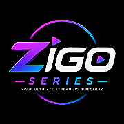

<div align="center">

  <!-- Logo -->
  

  # 🎬 ZIGO SERIES

  **The Ultimate Cyberpunk-Themed Web Directory for Verified Streaming Portals**  
  *Powered by [TP x STUDIO](https://tpxstudio.vercel.app)*

  [](https://developer.mozilla.org/en-US/docs/Web/HTML)
  [](https://developer.mozilla.org/en-US/docs/Web/CSS)
  [](https://developer.mozilla.org/en-US/docs/Web/JavaScript)
  [](https://discord.gg/bazxR8fA43)
  [](LICENSE)

  [Live Demo](https://tpxstudio.vercel.app) • [Report Bug](https://github.com/N3rdmade/TBCPL/issues) • [Request Portal](https://discord.gg/bazxR8fA43)

</div>

---

## 🌟 Overview

**ZIGO SERIES** is an ultra-fast, modern, responsive Web Directory indexing over **109+ verified streaming portals** spanning Movies, TV Shows, Anime, Manga, Live Sports, Paid Services, and Android Apps. 

Built with zero heavy dependencies, pure vanilla JS, and high-performance CSS glassmorphism, it offers a futuristic user interface equipped with dynamic particle animations, 3D card tilt effects, instant dropdown searching, and full Google Search SEO engine integration.

---

## ✨ Features

- ⚡ **109+ Verified Links:** Categorized into Movies (25), Anime (21), Manga (24), Live TV & Sports (17), Paid Services (13), and Apps (9).
- 🔍 **Live Search Dropdown:** Instant real-time filtering directly below the search bar with domain favicons and category badges.
- 📱 **Strict 2x2 Responsive Mobile Grid:** Formatted specifically for optimal tap targets and sleek layout on phone & desktop screens.
- 🎨 **Futuristic Glassmorphism UI:** Floating bottom glass tab bar, ambient glow orbs, and interactive 3D perspective tilt effects.
- 🌌 **HTML5 Canvas Particle Engine:** Embedded interactive particle network canvas background with zero external libraries.
- 🚀 **100/100 Lighthouse Performance:** Pure HTML/CSS/JS architecture with ultra-fast page load times and preconnected font servers.
- 🔍 **Google SEO & Rich Snippet Ready:** Built-in Schema.org `JSON-LD` structured data, OpenGraph tags, Twitter Cards, and Google search favicon links.

---

## 📂 Category Breakdown

| Category | Sites Indexed | Description |
| :--- | :---: | :--- |
| **🎬 Movies & Shows** | `25` | Free high-definition movie & TV show streaming portals. |
| **🐉 Anime** | `21` | Subbed & dubbed anime streaming platforms. |
| **📖 Manga & Comics** | `24` | Manga, Manhwa, and digital comic reader platforms. |
| **🏆 Live TV & Sports** | `17` | HD live sports, PPV events, and IPTV broadcast streams. |
| **👑 Paid Services** | `13` | Direct login links for popular premium streaming apps. |
| **📱 Apps & Tools** | `9` | APK downloads and web apps for mobile streaming. |

---

## 🛠️ Tech Stack

- **Markup:** HTML5 (Semantic Structure)
- **Styling:** CSS3 (Custom Variables, Flexbox, CSS Grid, Glassmorphism backdrop-blur)
- **Scripting:** Vanilla JavaScript ES6 (DOM Manipulation, Canvas Context 2D)
- **Icons & Fonts:** FontAwesome 6, Google Fonts (`Orbitron`, `Space Grotesk`, `Outfit`)
- **Metadata:** Schema.org JSON-LD, OpenGraph Protocol

---

## 🚀 Quick Start

### Option 1: Run Locally

1. **Clone the Repository:**
   ```bash
   git clone https://github.com/N3rdmade/TBCPL.git
   cd TBCPL
